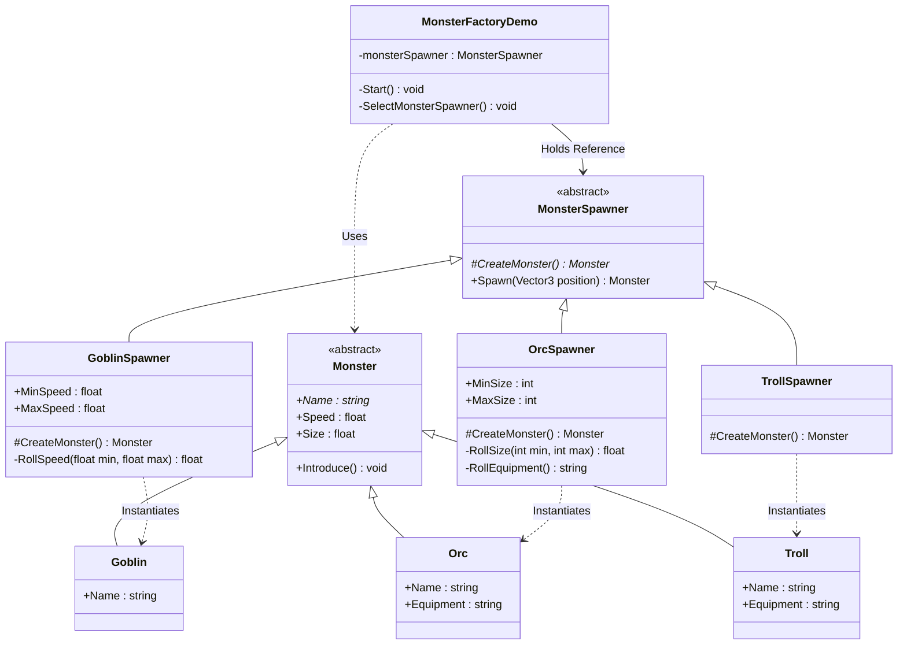
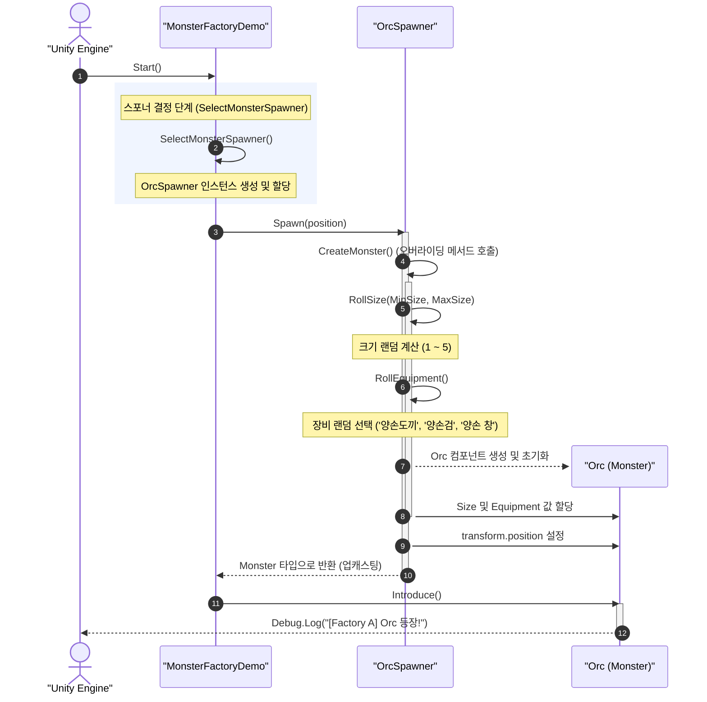

```mermaid
classDiagram
    class Monster {
        <<abstract>>
        +Name : string*
        +Speed : float
        +Size : float
        +Introduce() void
    }

    class Goblin {
        +Name : string
    }
    Monster <|-- Goblin

    class Orc {
        +Name : string
        +Equipment : string
    }
    Monster <|-- Orc

    class Troll {
        +Name : string
        +Equipment : string
    }
    Monster <|-- Troll

    class MonsterSpawner {
        <<abstract>>
        #CreateMonster()* Monster
        +Spawn(Vector3 position) Monster
    }

    class GoblinSpawner {
        +MinSpeed : float
        +MaxSpeed : float
        #CreateMonster() Monster
        -RollSpeed(float min, float max) float
    }
    MonsterSpawner <|-- GoblinSpawner
    GoblinSpawner ..> Goblin : Instantiates

    class OrcSpawner {
        +MinSize : int
        +MaxSize : int
        #CreateMonster() Monster
        -RollSize(int min, int max) float
        -RollEquipment() string
    }
    MonsterSpawner <|-- OrcSpawner
    OrcSpawner ..> Orc : Instantiates

    class TrollSpawner {
        #CreateMonster() Monster
    }
    MonsterSpawner <|-- TrollSpawner
    TrollSpawner ..> Troll : Instantiates

    class MonsterFactoryDemo {
        -monsterSpawner : MonsterSpawner
        -Start() void
        -SelectMonsterSpawner() void
    }
    MonsterFactoryDemo --> MonsterSpawner : Holds Reference
    MonsterFactoryDemo ..> Monster : Uses

```

```mermaid
sequenceDiagram
    autonumber
    actor Engine as "Unity Engine"
    participant Demo as "MonsterFactoryDemo"
    participant Spawner as "OrcSpawner"

    Engine->>Demo: Start()
    
    rect rgb(240, 245, 255)
        Note over Demo: 스포너 결정 단계 (SelectMonsterSpawner)
        Demo->>Demo: SelectMonsterSpawner()
        Note over Demo: OrcSpawner 인스턴스 생성 및 할당
    end

    Demo->>Spawner: Spawn(position)
    activate Spawner
    
    Spawner->>Spawner: CreateMonster() (오버라이딩 메서드 호출)
    activate Spawner
    
    Spawner->>Spawner: RollSize(MinSize, MaxSize)
    Note over Spawner: 크기 랜덤 계산 (1 ~ 5)
    
    Spawner->>Spawner: RollEquipment()
    Note over Spawner: 장비 랜덤 선택 ('양손도끼', '양손검', '양손 창')
    
    create participant Orc as "Orc (Monster)"
    Spawner-->>Orc: Orc 컴포넌트 생성 및 초기화
    
    Spawner->>Orc: Size 및 Equipment 값 할당
    deactivate Spawner
    
    Spawner->>Orc: transform.position 설정
    Spawner-->>Demo: Monster 타입으로 반환 (업캐스팅)
    deactivate Spawner

    Demo->>Orc: Introduce()
    activate Orc
    Orc-->>Engine: Debug.Log("[Factory A] Orc 등장!")
    deactivate Orc

```
