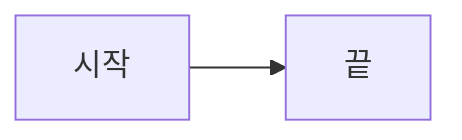
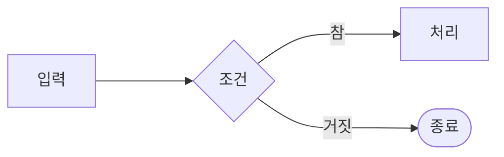
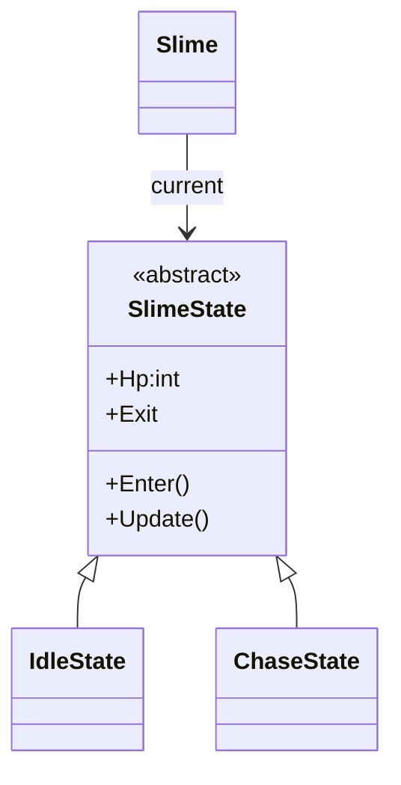
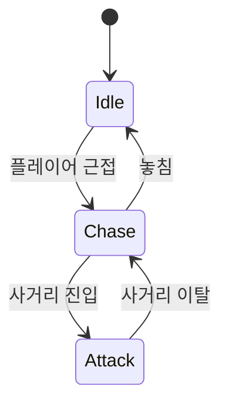
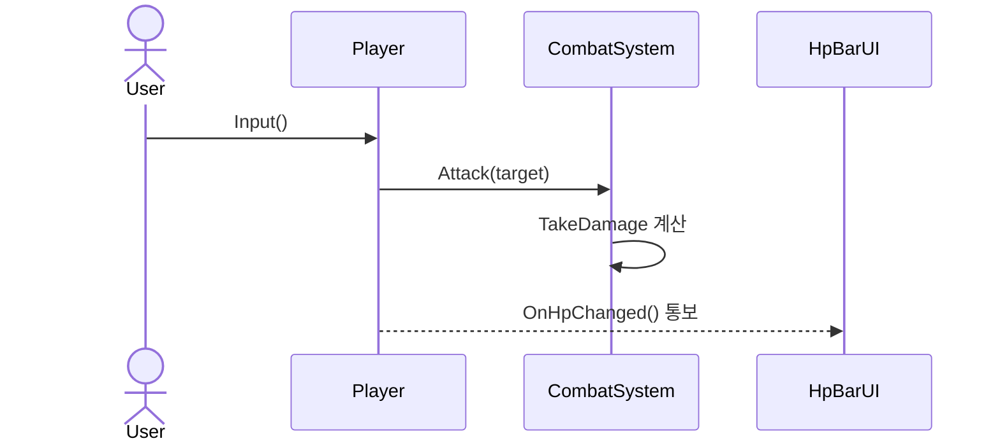
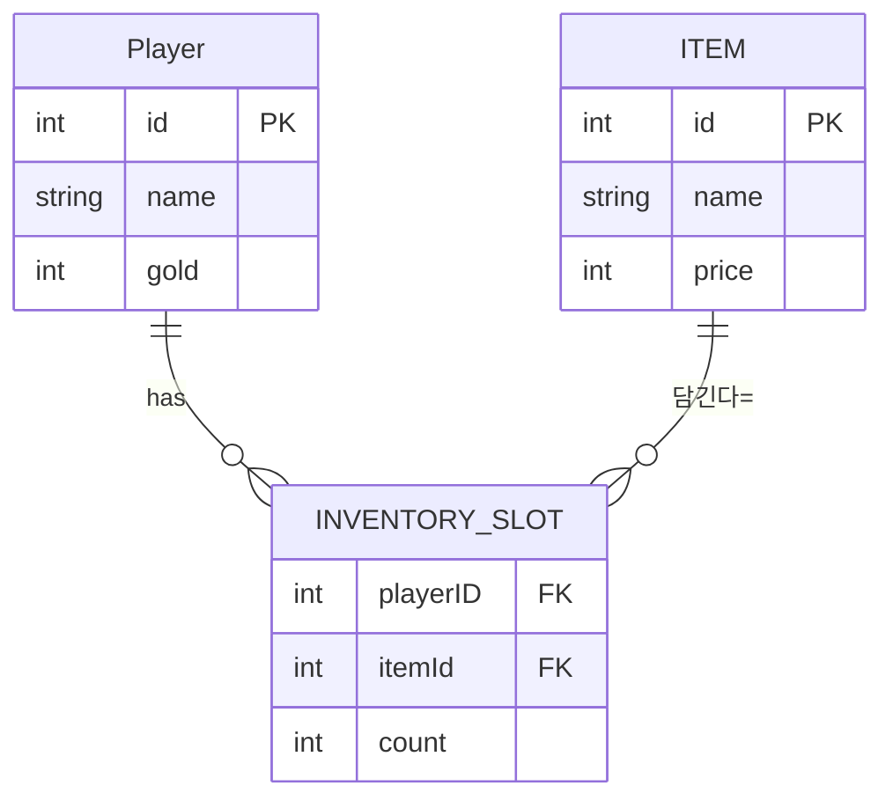

# Mermaid

## Mermaid란?

텍스트(코드)로 다이어그램을 그리는 도구. 마우스로 도형을 끌어다 그리는 대신, 간단한 문법을 마크다운 안에 적으면 그림이 자동으로 그려집니다.
- 순서도(flowchart), 클래스 다이어그램, 상태 다이어그램, 시퀸스 다이어그램, ER 다이어그램
- 코드라서 Git으로 관리,비교가 되고 수정 쉽습니다

## FLOWCHART - (순서도/흐름)

## 2. class diagram

- `<|--` : 상속/구현 (자식 `<|--` 부모 로 읽되, 화살표는 부모를 가리킴)
- `-->` : 참조/연관 (필드로 가짐, 합성)
- `*--` : 강한 포함(합성), `o--` : 약한 포함(집약)
- `<<abstract>>` / `<<interface>>` 스테레오타입 표시
- 멤버: `+` (public), `-`(private), `#`(protected)

## 3. state diagram - 상태 다이어 그램

- `[*]` : 시작/끝 지점
- `상태A --> 상태B : 전이 조건` : 상태 전이를 화살표로

## 4. sequenceDiagram - 시퀸스 다이어 그램

- `actor 별칭 as 이름` : 유저 or 플레이어 선언
-`participant 별칭 as 이름` : 참가자 선언
-`->>`: 호출(실선 화살표), `-->>` : 응답/통지(점선)

## 5. erDiagram - ER 다이어 그램 (데이터 모델 / DB 설계)
엔티티(테이블)와 그들 사이의 관계를 그린다.
"테이블의 한 행 = 객체"라고 봐도 무방함.

